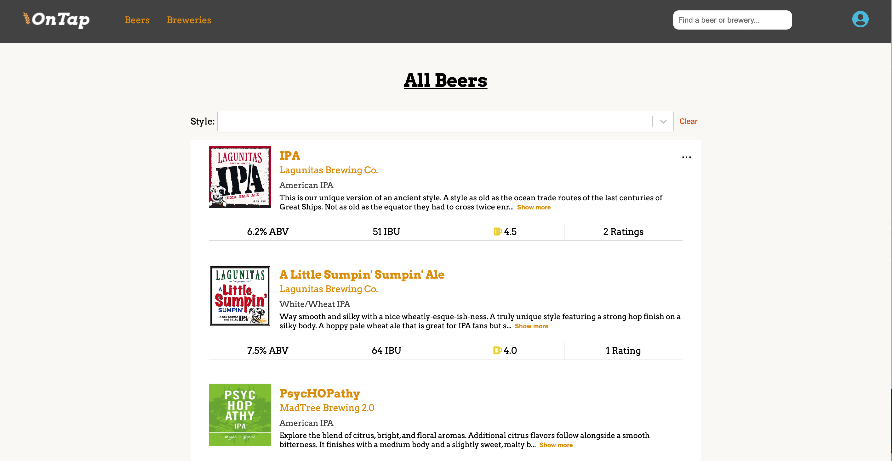
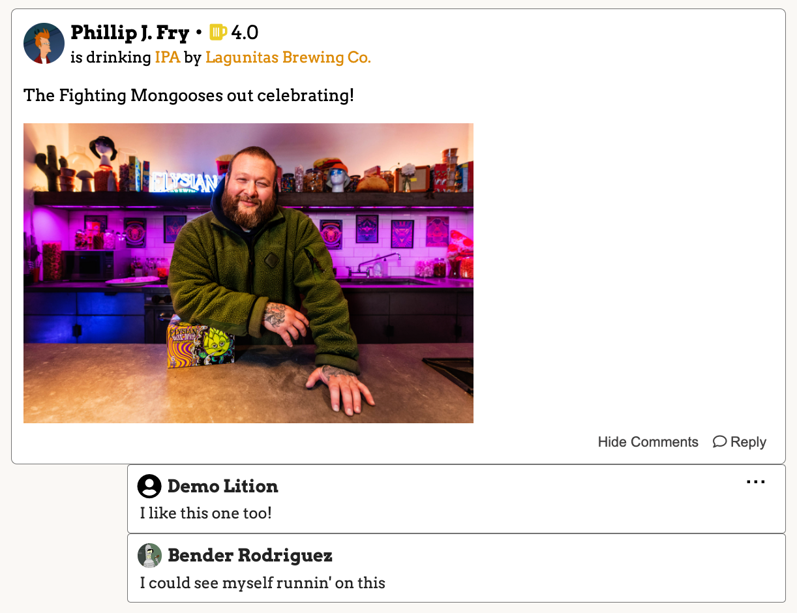

# OnTap

## Overview
<a href="https://on-tap-6vr6.onrender.com/">OnTap</a> is a partial clone of Untappd, a social platform that allows you rate, share, and learn about beers, breweries, and related events.

## Technologies Used
### Frameworks and Libraries
- React
- Redux
- Python
- Flask
- Javascript
- HTML
- CSS

### Database/ORM
- PostgreSQL
- SQLAlchemy

### Utilities
- AWS S3
- react-select
- react-photo-view

## Features

### Splash Page

### Beer and Brewery Browsing

Users can browse beers and breweries to discover new favorites, or use the search bar near the top to navigate to the specific beer or brewery they want to see details and activity for.

### Check Ins

When a user tries a beer or just wants to share one of their past experiences, they can do so on the beer's details page. An optional image can be included.

#### Comments
Once a check-in exists, other users can respond back with agreement or disapproval. Let's keep things civil!

### Beer and Brewery Submissions

The site provides a way for logged in users to add breweries that they wish to be the authority on. Once a brewery is added, any logged in user can submit a beer to be added as part of that brewery.

If a user is the owner of a beer or brewery, they will see options to edit or delete it.

### User Profiles

When a user signs up, a user profile page is generated for them. From this page users can see their past check-ins, beers/breweries they have created, and create new beers/breweries.

## Future Goals

### Cheers
- Users will be able to show their approval through a simple button rather than commenting

### Friends
- Users will receive a new option to view recent activity from those they've connected with as a friend.
- Users will be able to send their friends DMs

### Lists
- Users will be able to create wishlists containing beers they want to remember to try later.

### Venues
- Users will be able to check in at specific venues and find where certain beers are sold.

### OAuth
- Users will be able to sign up and log in using their Google account
